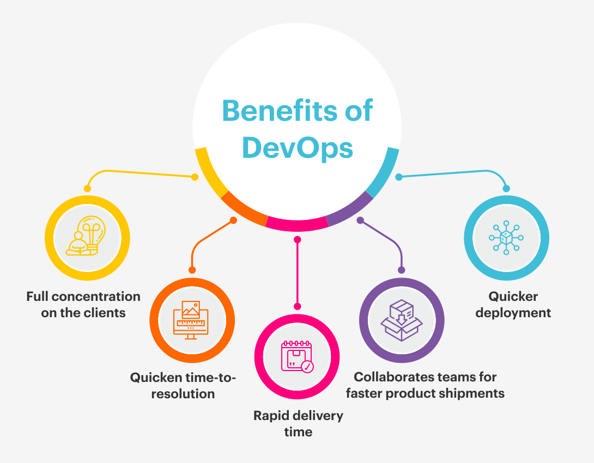
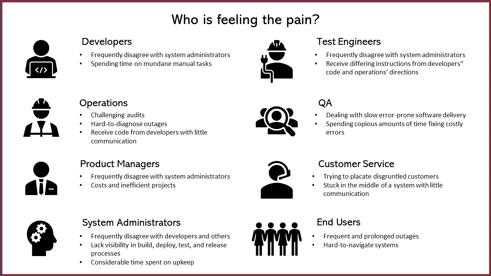
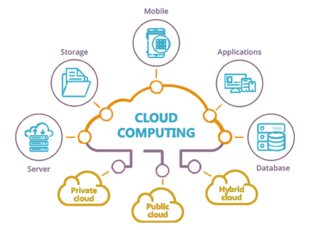

## What is DevOps? 

DevOps is a software development methodology that emphasizes collaboration and communication between development teams and operations teams, with the goal of automating the software delivery process and improving the quality of software products.

DevOps combines practices from software development (Dev) and IT operations (Ops) to enable faster and more efficient delivery of software products. It involves the use of automation tools, such as continuous integration and continuous delivery (CI/CD) pipelines, to streamline the process of testing and deploying code changes.

DevOps also emphasizes a culture of collaboration and shared responsibility between development and operations teams, with a focus on improving communication and reducing silos. This collaboration can help to identify and resolve issues more quickly, and can lead to more reliable and stable software products.

Overall, DevOps is a methodology that enables organizations to deliver software products more quickly and efficiently, while improving the quality and reliability of those products through increased collaboration and automation.
## Benefits of devops for business?

- Faster time-to-market: By automating the software delivery process, DevOps enables businesses to release new features and updates to their products more quickly.

- Improved quality: DevOps emphasizes continuous testing and feedback, which can lead to higher-quality software products.

- Increased collaboration: DevOps promotes a culture of collaboration and shared responsibility between development and operations teams, which can lead to faster issue resolution and more efficient workflows.

- Greater scalability: DevOps enables businesses to quickly scale their infrastructure to meet changing demand, without sacrificing performance or reliability.

- Improved security: DevOps includes security considerations throughout the software development lifecycle, helping businesses to identify and address security risks more quickly.

- Higher customer satisfaction: By delivering high-quality software products more quickly and efficiently, businesses can improve customer satisfaction and loyalty.

Overall, DevOps provides businesses with a range of benefits that can help to increase efficiency, reduce costs, and improve customer satisfaction. By adopting DevOps practices, businesses can stay competitive in a rapidly changing market, and can deliver high-quality products that meet the needs of their customers.

## What does the role entail?

The DevOps role entails a wide range of responsibilities that vary depending on the specific organization and its needs. However, some common responsibilities of DevOps engineers and professionals include:

1. Collaboration: DevOps professionals work closely with development teams, operations teams, and other stakeholders to identify and address issues, share information, and ensure that software products are delivered on time and with high quality.
   
2. Automation: DevOps professionals use automation tools and scripts to streamline the software delivery process, reduce manual errors, and improve efficiency.
   
3. Continuous Integration and Continuous Delivery (CI/CD): DevOps professionals are responsible for setting up and maintaining the CI/CD pipeline, which includes continuous testing, integration, and delivery of code changes.
   
4. Infrastructure Management: DevOps professionals manage the infrastructure and configuration of servers, networks, and cloud environments to ensure that applications are performing optimally and meeting the needs of the business.
   
5. Monitoring and Troubleshooting: DevOps professionals monitor applications and infrastructure to identify and address issues before they become critical, and troubleshoot problems when they occur.

6. Security: DevOps professionals are responsible for ensuring that applications and infrastructure are secure, by implementing best practices for security, compliance, and data protection.

Overall, the DevOps role is multifaceted and requires a broad set of skills and experience, including programming, automation, infrastructure management, and collaboration. DevOps professionals play a critical role in ensuring that software products are delivered quickly, efficiently, and with high quality, and that they meet the needs of the business and its customers.

## Who do DevOps Engineers work with?

DevOps Engineers work with a wide range of stakeholders within an organization, including:

- Development teams: DevOps Engineers work closely with development teams to understand the software product being built, and to ensure that code changes are delivered in a timely and efficient manner.

- Operations teams: DevOps Engineers work with operations teams to ensure that the software product is deployed and maintained in a production environment that meets the needs of the business and its customers.

- Quality Assurance (QA) teams: DevOps Engineers work with QA teams to ensure that code changes are properly tested and validated before they are deployed to production.
  
- Business stakeholders: DevOps Engineers work with business stakeholders to understand their needs and requirements, and to ensure that the software product is meeting those needs.
  
- Security teams: DevOps Engineers work with security teams to ensure that the software product is secure, and to implement best practices for security, compliance, and data protection.

Overall, DevOps Engineers work with a diverse group of stakeholders, and must be able to communicate effectively with all of them to ensure that the software product is delivered on time, with high quality, and meets the needs of the business and its customers.

## What other teams does a DevOps Engineer interact with?

In addition to the teams mentioned in my previous response, a DevOps Engineer may also interact with other teams within an organization, such as:

Release Management: DevOps Engineers work with release management teams to coordinate the release of software products to production, ensuring that the process is smooth and reliable.

Project Management: DevOps Engineers may work with project management teams to ensure that the software delivery process is aligned with project timelines and goals.

Marketing and Sales: DevOps Engineers may interact with marketing and sales teams to understand customer needs and to ensure that the software product is meeting those needs.

Customer Support: DevOps Engineers may work with customer support teams to understand customer issues and to ensure that the software product is meeting customer needs and expectations.

Executive Management: DevOps Engineers may interact with executive management teams to provide updates on the status of software delivery, and to ensure that the software delivery process is aligned with business goals and objectives.

## What are their common deliverables?

1. Infrastructure as Code (IaC): DevOps Engineers use tools like Terraform, CloudFormation, or Ansible to create and maintain infrastructure as code, which can be version controlled, tested, and deployed like software code.
   
2. Configuration Management: DevOps Engineers use tools like Chef, Puppet, or Ansible to automate the configuration of servers, networks, and other infrastructure components, and ensure that they are consistent across different environments.
   
3. Continuous Integration and Continuous Delivery (CI/CD) Pipelines: DevOps Engineers design and implement CI/CD pipelines to automate the software delivery process, including continuous testing, integration, and delivery of code changes.
   
4. Monitoring and Alerting: DevOps Engineers set up and maintain monitoring and alerting systems to detect and respond to issues in real-time, and to ensure that applications are performing optimally.
   
5. Security and Compliance: DevOps Engineers implement security and compliance best practices, and ensure that applications and infrastructure are secure and meet industry standards and regulations.
   
6. Documentation: DevOps Engineers create and maintain documentation for infrastructure, code changes, and other relevant processes and procedures.

## What is the value of a DevOps Engineer?

A DevOps Engineer is responsible for bridging the gap between development and operations teams, ensuring that software products are delivered quickly, efficiently, and with high quality. They bring a range of skills and experience, including automation, collaboration, CI/CD, infrastructure management, monitoring and troubleshooting, and security. By leveraging these skills, DevOps Engineers can help organizations to achieve their business goals and objectives by delivering high-quality software products quickly and efficiently.

## How do DevOps Engineers fit into the SDLC?
DevOps Engineers fit into the Software Development Life Cycle (SDLC) in the later stages such as Continuous Integration and Continuous Delivery (CI/CD), Release Management, Monitoring and Troubleshooting, and Security and Compliance.

Where can you progress from here?

A DevOps role can lead to a variety of career paths, depending on the individual's skills, interests, and career goals. Some common career paths that DevOps professionals may progress to include:

- Site Reliability Engineer (SRE): SREs focus on the reliability and availability of software products, and work to ensure that applications are performant, scalable, and fault-tolerant.

- Cloud Architect: Cloud Architects design and manage cloud-based infrastructure, including public, private, and hybrid clouds, to ensure that applications are deployed and maintained in a scalable, efficient, and cost-effective manner.

- DevOps Manager: DevOps Managers oversee the development and deployment of software products, and are responsible for ensuring that the DevOps team is working efficiently and effectively, and that software delivery is meeting the needs of the business.

- Security Engineer: Security Engineers focus on implementing and maintaining security best practices, and ensuring that applications and infrastructure are secure and meet industry standards and regulations.

- Technical Product Manager: Technical Product Managers bridge the gap between technical and non-technical stakeholders, and are responsible for the strategic direction of software products, including development, deployment, and maintenance.

- Software Developer: Some DevOps professionals may choose to transition into software development roles, leveraging their experience with the software delivery process to build high-quality software products.

Overall, DevOps professionals have a range of career paths available to them, depending on their skills, interests, and career goals. By building on their experience and knowledge of the software delivery process, they can progress to roles that allow them to make a significant impact on the development and deployment of software products.

## What is Cloud Computing?

Cloud computing refers to the delivery of on-demand computing resources, such as servers, storage, applications, and services, over the internet. Rather than purchasing and maintaining physical hardware and infrastructure, cloud computing allows organizations to access resources as needed, on a pay-per-use basis. This enables organizations to scale up or down quickly and efficiently, and to only pay for the resources they actually use, rather than investing in and maintaining their own hardware and infrastructure. Cloud computing also enables remote access to resources, making it easier for geographically dispersed teams to collaborate and work together.

Who is using DevOps?

DevOps is widely adopted by companies across various industries to streamline their software development and operations processes, improve collaboration, and enhance overall efficiency. Here are three case studies that showcase the successful implementation of DevOps:

1. Amazon:
Amazon is one of the pioneers of DevOps and has been using it to drive innovation and scale their services rapidly. With the adoption of DevOps, Amazon transitioned from a monolithic application architecture to a microservices-based approach. This change allowed them to make multiple deployments per day, compared to their previous deployment frequency of once every few months. By automating their infrastructure provisioning and deployment processes, Amazon has significantly reduced the time it takes to release new features and services while maintaining high availability and performance.

Key takeaways:

- Transitioned to microservices-based architecture.
- Implemented automated infrastructure provisioning and deployment.
- Accelerated deployment frequency from months to multiple times a day.
  
---
2. Netflix:
Netflix is another well-known example of successful DevOps implementation. As the company transitioned from DVD rental to streaming services, they needed a more agile and scalable infrastructure to support millions of users worldwide. By embracing DevOps principles and practices, Netflix developed its own suite of tools, like Spinnaker for continuous delivery and Chaos Monkey for resilience testing. These tools have allowed Netflix to achieve rapid deployment of new features and services, better collaboration between development and operations teams, and increased resilience of their systems.

Key takeaways:

- Developed in-house DevOps tools for continuous delivery and resilience testing.
- Achieved rapid deployment of new features and services.
- Improved collaboration between development and operations teams.
---
3. Target:
Target, a leading retail company, adopted DevOps to modernize its technology infrastructure and streamline its software development processes. By implementing DevOps practices, Target transformed its IT culture by breaking down silos, promoting collaboration, and encouraging experimentation. The company used tools like Jenkins, Chef, and Docker to automate their build, test, and deployment processes, enabling them to release new features and updates faster. Additionally, Target established internal "Dojos" – immersive learning environments – to train and support their teams in adopting DevOps practices and methodologies.

Key takeaways:

- Transformed IT culture by breaking down silos and promoting collaboration.
- Automated build, test, and deployment processes with tools like Jenkins, Chef, and Docker.
- Established "Dojos" for immersive DevOps training and support.
  
These case studies demonstrate how adopting DevOps practices can lead to significant improvements in software development processes, team collaboration, and infrastructure management, ultimately resulting in faster deployments, better quality products, and increased resilience.